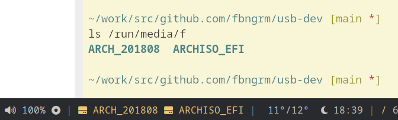

# usb-dev
Polybar script for displaying and mounting/unmounting removable disks.

- Left-click a partition to mount it
- Left-click a mounted partition to open a terminal at the device's mount point
- Middle-click a mounted partition to open a file explorer at the device's mount point
- Right-click to unmount
- Right-click unmounted device to power-off

Supports drives with multiple partitions and each partition can be mounted individually. Will display partition's label if present, otherwise the name of the partition itself.

Honors theme colors in ~/.Xresources; Unmounted partitions will show as "red" and mounted as "green" (the resolved colors will be theme-dependent).

Based on [polybar-removable-disks](https://github.com/howey-aus/polybar-removable-disks/tree/master)



```
[module/removable-disks]
type = custom/script
exec = ~/.config/polybar/scripts/usb-dev.sh
```

## Dependencies

* `jq`
* `udisks2`
* `xrdb`
